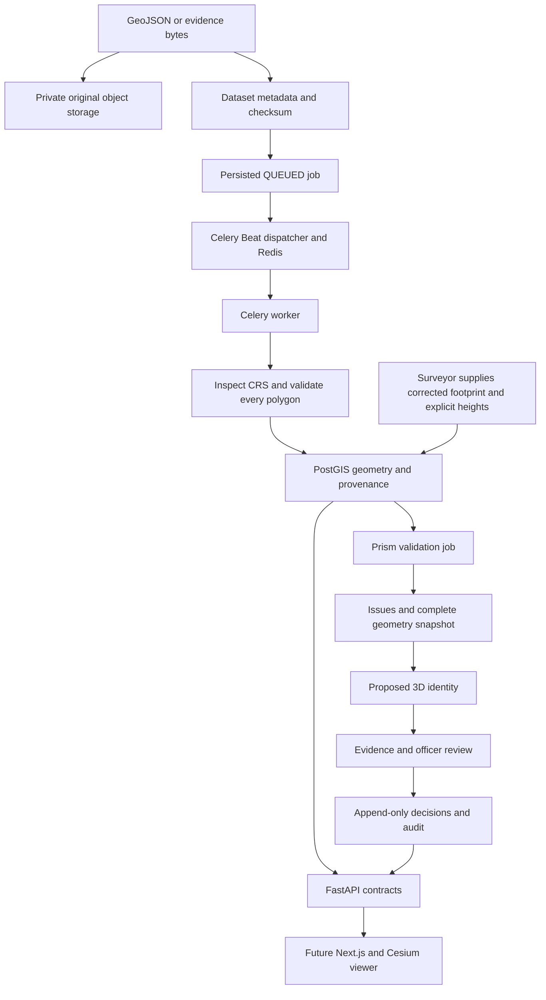

# Architecture and API contracts

## Data flow

Original evidence and spatial objects must exist before review. Storage is used throughout the pipeline rather than only at its end. AI-assisted extraction is an explicit future adapter; it cannot pretend to have produced a result.

## Relational schema

| Table | Role and relationships |
|---|---|
| app_users | Supabase subject UUID, backend-managed role and active flag |
| spatial_objects | Typed parcel/building/floor/unit/underground/shared/easement/infrastructure hierarchy; parent_id and root parcel_id self-FKs |
| spatial_relationships | AFFECTS, SERVES, SHARED_BY, PREDECESSOR links between objects; schema foundation, management API deferred |
| source_datasets | Original object key, SHA-256, size, source category, format inspection and ingestion status |
| geometry_versions | Immutable object geometry, monotonically increasing version, source dataset and author |
| evidence | Object-to-source association with description |
| property_rights | Object, supporting evidence, recorded right type and party reference |
| processing_jobs | Typed input source or geometry, state, progress, timestamps, errors and result/output asset references |
| validation_issues | Validation job, subject geometry, optional related geometry, severity, code and explanation |
| ulpin_identities | One persistent proposed identity per property space; issued geometry version and scheme label |
| review_cases | Exact geometry and completed validation job, submitter, review status |
| review_decisions | One immutable decision per submitted case; reviewer and reason |
| audit_events | Immutable actor, action, entity reference, timestamp and event detail |

Geometry and hierarchy are relational, not JSON geometry blobs. JSONB is limited to source inspection, transformation descriptions, job results and audit detail. Every spatial column receives a GiST index. Foreign keys used for traversal and filtering are indexed. Constraints enforce object types, roots, source categories, vertical bounds, version uniqueness and job inputs. Triggers enforce parent-kind/root consistency, synthetic designation and immutable history.

The private `cadastre` schema is not intended for the Supabase Data API. RLS is enabled on every domain table; only a pre-provisioned `astra_app` backend role gets policies and limited grants. Do not add this schema to exposed schemas or grant browser roles access. Hosted provisioning must create the runtime role before migration, or explicitly provision its equivalent policies afterward. There is no blanket public/authenticated policy.

## Geometry representation

- `footprint`: PostGIS Polygon, EPSG:4326, horizontal map/API representation.
- `metric_footprint`: PostGIS Polygon in the selected projected metre-based SRID.
- `shell`: optional PostGIS POLYHEDRALSURFACE Z in the same metric SRID. The SRID describes horizontal coordinates; `elevation_reference` separately describes Z.
- `z_min/z_max`: explicit lower and upper elevations in metres, not floor numbers.
- A FLOOR object's lower Z is its floor elevation; its upper-minus-lower Z is its floor-to-floor extent. A UNIT's bounds are its own volume extent; they need not equal the floor's.
- Basement depth cannot be inferred from negative elevation alone. The height reference must identify a local ground reference before treating negative values as depth.
- `height_estimated`: explicit quality qualifier; absent heights remain null.
- CRS/source CRS, exact transformation descriptions, source category, confidence, method, actor and timestamp travel with each version. AI confidence, when eventually supplied, is a model score, not certified accuracy.
- Canonical geometry hash changes with the footprint, heights or vertical reference. The proposed identity does not change with a correction. Future split/merge workflows will use new objects and predecessor links.

A closed shell is constructed by extrusion. The service uses footprint intersection area × intersecting height for supported prism volume conflicts; it does not mistake PostGIS ST_IsValid (2D) or surface intersection alone for general solid validity.

## API responsibilities

All domain endpoints are under `/api/v1`, authenticated, rate limited, and validated by Pydantic. Lists are bounded by limit/offset. OpenAPI is generated by FastAPI at `/openapi.json`.

| Group | Actions |
|---|---|
| /auth/me | Return authenticated membership and role |
| /parcels, /buildings, /floors, /units | List, retrieve and create typed objects |
| /underground, /shared-spaces, /easements, /infrastructure | Same typed object responsibilities |
| /spatial/{id}/geometry | Append a corrected geometry version; read version history |
| /3d/{id} | Latest footprint, explicit heights, reference and provenance for future viewer extrusion; not a GLB endpoint |
| /datasets | Upload original bytes and create ingestion job, list/inspect sources, authenticated download |
| /processing | Queue supported processing, inspect state, cancel a queued job |
| /validation/{job_id}/issues | Read actual findings from that job |
| /ulpin/{object_id} | Issue or retrieve persistent Proposed 3D ULPIN after validation |
| /ulpin?identifier=... | Exact proposed-identifier lookup |
| /evidence | Attach and list stored evidence |
| /rights | Record and list evidence-backed assertions |
| /reviews | Submit and inspect reviews; officer decision endpoint |
| /audit | Read audit history, optionally filtered by entity |
| /capabilities | Describe implemented adapters and deferred features honestly |

## Job and review correctness

A job row is committed before dispatch. Beat polls queued rows; duplicate delivery is harmless because the worker atomically claims only QUEUED rows. Result geometry, issues, audit and COMPLETED status commit together. Exceptions roll back partial output and are persisted as FAILED in a separate transaction. Redis unavailability leaves work queued for later dispatch.

Active worker handlers hold their job lock. The dispatcher marks old unlocked RUNNING rows failed after ten minutes, allowing recovery from an interrupted worker without making up success. Cancellation is limited to QUEUED. Progress is a coarse real stage (0 queued, 10 claimed, 100 committed), not an animated percentage.

Geometry editing and validation serialize on the root parcel. Validation stores the exact set of current geometry IDs. Identity issuance and review acceptance require passing results for current geometry and an unchanged parcel snapshot. An officer cannot accept their own submission. Review acceptance is a prototype decision, not a property registration.

## Reserved stack and later phases

The frontend remains Next.js 15 App Router, TypeScript, Tailwind, shadcn/ui, Lucide, Zustand and TanStack Query. CesiumJS remains primary GIS with Turf.js and MapLibre fallback. OGC 3D Tiles 1.1, GLB and structural metadata remain the asset targets.

Later data adapters use GDAL, GeoPandas, Rasterio, PDAL, Open3D, OpenCV and the proposed PyTorch model families. Blender Python API and glTF Transform provide production asset generation. DVC, MLflow, Grad-CAM and Great Expectations belong to actual model/data workflows, not placeholder installations. Vitest, Playwright, Locust, Sentry, Grafana and deployment configuration are deferred until their corresponding frontend, load and operational scope exists. Prometheus currently exposes only library-provided process metrics.

Cloudflare Pages frontend and Cloud Run API compatibility, worker hosting and persistent Redis must be verified during deployment planning. No free-tier capacity promise is made.

## Technical sources checked

- [Supabase JWT verification](https://supabase.com/docs/guides/auth/jwts)
- [Supabase changelog](https://supabase.com/changelog): reviewed current index; extension-version pinning is not used.
- [Celery task execution](https://docs.celeryq.dev/en/stable/userguide/tasks.html)
- [PostGIS ST_IsValid](https://postgis.net/docs/ST_IsValid.html)
- [PostGIS ST_3DIntersects](https://postgis.net/docs/ST_3DIntersects.html)
